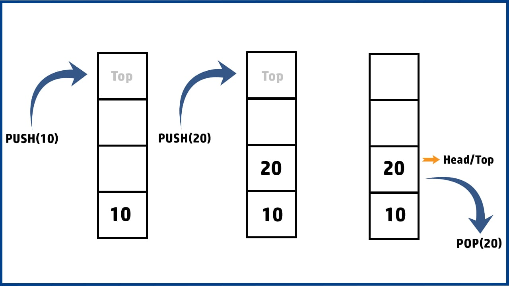

# INTRODUCTION 
Stack is a linear data structure in which we restrict the operations over it in a particular order.

The order in which insertions and deletions are allowed is called LIFO (Last In First Out) or FILO (First In Last Out) i.e. the element that is inserted in the last is the first to come out or the element that is inserted first is the last to come out.

Both insertions and deletions to the stack are done only on one end called as top of the stack.

A Stack can be visualised as plates kept one over the other in a college canteen. Adding a plate or removing a plate happens only on the top. The plate on the top is the first to be be removed and the plate that is put first is the last to be removed.

The stack can be better understood using the following diagram.
 

# CONCEPT 
Both insertions and deletions to the stack are done only on one end called as top of the stack.

A Stack can be visualised as plates kept one over the other in a college canteen. Adding a plate or removing a plate happens only on the top. The plate on the top is the first to be be removed and the plate that is put first is the last to be removed.

The stack can be better understood using the following diagram.
Note : A stack is said to be in Overflow state when it is completely full and is said to be in Underflow state if the stack is completely empty.

### The major operations we perform on stack are :
- Push() - Inserts an element to the top of the stack. It generates a Stack overflow error if there is no memory space available for inserting the element.
- Pop() - Removes an element from the top of the stack. It generates a Stack underflow error if there are no elements in the stack to be removed.
- Peek() - Gives the element on the top of the stack without modifying the contents of the stack.
- isEmpty() - Returns true if the stack is empty , else returns false
- Implementation of stacks
### There are two ways of implementing stacks :
- Using Arrays  
- Using Linked Lists  
